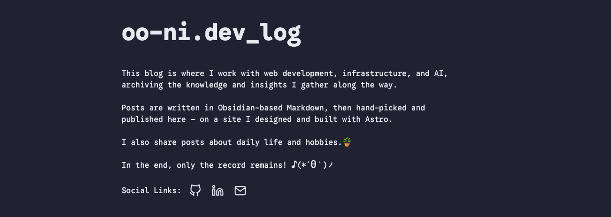

# oo-ni.dev_log

A personal tech blog built with [Astro](https://astro.build). Posts are written in Obsidian and
published to this static site through a sync script.

🔗 Live: **[ondl.site](https://ondl.site)**



---

## Table of Contents

- [Overview](#overview)
- [Tech Stack](#tech-stack)
- [Project Structure](#project-structure)
- [Obsidian Integration](#obsidian-integration)
- [Authoring Workflow](#authoring-workflow)
- [Build & Run](#build--run)
- [Deployment](#deployment)
- [Features](#features)
- [Design System](#design-system)

---

## Overview

```
┌─────────────┐   sync.mjs    ┌──────────────────┐   astro build   ┌─────────┐   git push   ┌────────┐
│  Obsidian   │ ───────────▶  │  src/content/    │ ──────────────▶ │  dist/  │ ───────────▶ │ Vercel │
│   Vault     │  publish:true │  posts/*.md      │   + pagefind    │ (static)│  auto deploy │  (CDN) │
│  (writing)  │   only        │  (normalized MD) │                 │         │              │        │
└─────────────┘               └──────────────────┘                 └─────────┘              └────────┘
```

1. **Write** — Author markdown in the Obsidian Vault (mark with `publish: true` in frontmatter).
2. **Sync** — `node sync.mjs` selects only the published posts, converts Obsidian syntax to standard markdown, and copies them into `src/content/posts/`.
3. **Build** — Astro generates static HTML and Pagefind builds the search index.
4. **Deploy** — Pushing to GitHub triggers an automatic build & deploy on Vercel.

---

## Tech Stack

| Area | Technology |
| --- | --- |
| Framework | Astro (static output, `output: static`) |
| Content | Astro Content Collections (`glob` loader + Zod schema) |
| Sync | Node.js script (`sync.mjs`) — no external dependencies |
| Search | [Pagefind](https://pagefind.app) (static index) |
| Comments | [Cusdis](https://cusdis.com) (no account required) |
| Fonts | Astro Fonts API (self-hosted) + Google Fonts / jsDelivr |
| Hosting | Vercel (auto deploy via GitHub) |

---

## Project Structure

```
io.obs_log/
├── astro.config.mjs   # Astro config (self-hosted fonts, syntax highlight off)
├── sync.mjs           # Obsidian → src/content sync script
├── src/
│   ├── content/       # synced posts + collection schema (do NOT edit directly)
│   ├── layouts/       # shared layout (header/footer/theme/view transitions)
│   ├── components/    # UI parts (sidebar, post card, comments, socials, ...)
│   ├── pages/         # routes (home, posts, categories, tags, archives, search)
│   ├── lib/           # category path parsing & tree building
│   └── styles/        # global styles + design tokens
└── public/            # static assets (synced images under attachments/)
```

> `src/content/posts/` and `public/attachments/` are wiped and regenerated by `sync.mjs` on every run. **Do not edit them directly.**

---

## Obsidian Integration

`sync.mjs` scans the Obsidian Vault and normalizes only the posts marked for publishing.

```bash
node sync.mjs                          # ~/Obsidian Vault (default)
OBSIDIAN_VAULT="/path/to/Vault" node sync.mjs   # via env var
node sync.mjs "/path/to/Vault"         # via CLI argument
```

Vault path resolves as: **CLI argument → `OBSIDIAN_VAULT` env var → `~/Obsidian Vault`**. No machine-specific path is hardcoded, so it's portable across PCs.

### Publish Condition

Only posts with **`publish: true`** in their frontmatter are published. Everything else (`draft`, `publish: false`, etc.) is ignored.

### Frontmatter Mapping

Example Obsidian post:

```yaml
---
title: Circuit Breaker
created: 2026-06-18
domain: Computer Science      # category level 1
stack:                        # category level 2 (first item is used)
  - Design Pattern
tags:
  - MSA
  - Web
status: WIP
publish: true
---
```

| Obsidian field | Mapped to | Notes |
| --- | --- | --- |
| `title` | Post title | Falls back to the filename |
| `created` | Publish date | `YYYY-MM-DD` is extracted |
| `domain` + `stack[0]` | **Hierarchical category** | Combined as `Computer Science / Design Pattern` |
| `tags` | Tags | Independent of the category tree; used only on tag pages |
| `description` | Summary / meta | Manual value wins; otherwise an LLM (Claude Haiku) summary, cached by content hash; falls back to the body's opening text |
| `status` | Writing status | The post's current writing state (e.g. `Draft` / `WIP` / `Done`) — for the author's own tracking in Obsidian; does not affect publishing |
| `publish` | Publish flag | Only `true` is published |

> The category tree is built **only from `domain`/`stack`**. Tags (`#MSA`, etc.) never appear in the tree.

### Syntax Conversion

- `![[image.png]]` → `` (image is copied into `public/attachments/`)
- `[[Other Note|alias]]` → a link (`[alias](/posts/slug)`) if the target is published, otherwise plain text
- Frontmatter is normalized and rewritten according to the table above

---

## Authoring Workflow

```bash
# 1) Write a post in Obsidian (publish: true)

# 2) Sync only
npm run sync          # = node sync.mjs

# 3) Sync + commit + push (all the way to auto deploy)
npm run post          # = node sync.mjs && git add -A && git commit && git push
```

Running `npm run post` commits and pushes the synced posts, and Vercel automatically deploys a new build.

### AI summaries (optional)

When `ANTHROPIC_API_KEY` is set, posts without a manual `description` get an LLM-generated summary (Claude Haiku) during sync. Results are cached by content hash in `.summary-cache.json`, so unchanged posts are never re-summarized. Without the key, sync falls back to the body's opening text — no error.

```bash
ANTHROPIC_API_KEY=sk-ant-... npm run sync
```

---

## Build & Run

```bash
npm install           # install dependencies

npm run dev           # dev server (http://localhost:4321) — live reload
npm run build         # production build (astro build && pagefind --site dist)
npm run preview       # preview the build locally
```

> **Search only works in a production build.** `npm run dev` has no Pagefind index (`/pagefind/`), so the search page shows a notice instead. To test search, use `npm run build && npm run preview`.

---

## Deployment

- **Hosting**: Vercel (connected to a GitHub repository)
- **Trigger**: pushing to the `main` branch → Vercel runs `npm run build` and deploys automatically
- **Output**: a fully static site served from the global CDN (edge). There are no server functions, so the **region setting has no effect**.
- If a deploy gets stuck, use **Promote to Production** (instant rollback) on the last healthy deployment in the Vercel dashboard → Deployments.

---

## Features

- **Hierarchical categories** — tree built from `domain/stack`, expandable in the sidebar (`src/lib/categories.ts`)
- **Tags / Archive** — per-tag listings and a year/month archive
- **Full-text search** — Pagefind. Only post bodies (`data-pagefind-body`) are indexed; header and sidebar are excluded
- **Comments** — Cusdis. No account required (name + content). Set `appId` in `src/components/Comments.astro`
- **Dark mode** — `data-theme` toggle with a circular reveal transition originating from the click point (View Transitions API)
- **Page transitions** — Astro `<ClientRouter />` plus a fade-up entrance animation
- **Accessibility / performance** — keyboard focus outlines, `prefers-reduced-motion` support, font preloading

---

## Design System

All design tokens are managed as CSS variables in [`src/styles/global.css`](src/styles/global.css).

### Fonts

Three fonts are used, each with a distinct role.

| Variable | Font | Loading | Used for |
| --- | --- | --- | --- |
| `--font-app` | **Google Sans Code** | Astro Fonts API (self-hosted, preload) | Header, sidebar profile, card category/tags, chips, code, home intro, page description (italic) |
| `--font-serif` | **Noto Serif KR** | Google Fonts CDN | Post body, card excerpt (= `body` default) |
| `--font-sans` | **Pretendard** | jsDelivr CDN | Page titles, post titles/headings, card title/date, Categories, archive, footer |

Design intent: **serif for comfortable reading in body text, sans (Pretendard) for crisp titles and meta, and monospace (Google Sans Code) for functional elements** like categories, tags, and code.

> `-webkit-font-smoothing` is intentionally left at its default (not `antialiased`), which renders text slightly bolder/sharper on macOS.

### Colors

| Token | Light | Dark | Used for |
| --- | --- | --- | --- |
| `--background` | `#fdfdfd` | `#212737` | Background |
| `--foreground` | `#282728` | `#eaedf3` | Primary text |
| `--accent` | `#006cac` | `#ff6b01` | Links, emphasis, hover |
| `--muted` | `#e6e6e6` | `#343f60` | Secondary background (code/chips) |
| `--muted-foreground` | `#6b7280` | `#afb9ca` | Secondary text (dates, descriptions) |
| `--border` | `#ece9e9` | `#ab4b08` | Borders, dividers |
| `--code` | `#c7254e` | `#ff7b72` | Code text (reddish) |

The theme is switched via the `<html data-theme="light|dark">` attribute, and re-applied from `localStorage` before first paint and on every page transition (`astro:after-swap`) to prevent flashing.

### Layout & Typography

- **Layout widths** — `--maxw: 64rem` (sidebar layout), `--maxw-prose: 48rem` (reading), `--sidebar-w: 15rem`
- **Body spacing** — post detail (`.prose`) reproduces Obsidian reading-view spacing (paragraph `line-height: 2.0`, heading top margins, etc.)
- **Link underlines** — active nav uses a wavy underline; in-body links use a dashed underline
- **Syntax highlighting** — disabled (`syntaxHighlight: false`); code is shown in the single `--code` color

---

## License

Released under the [MIT License](LICENSE).
